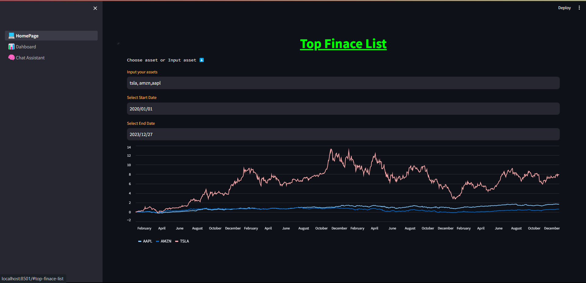
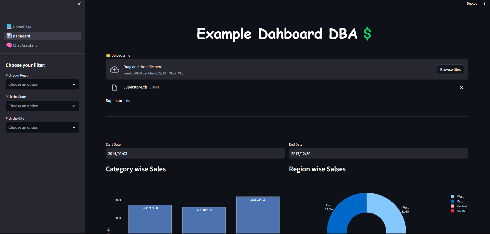
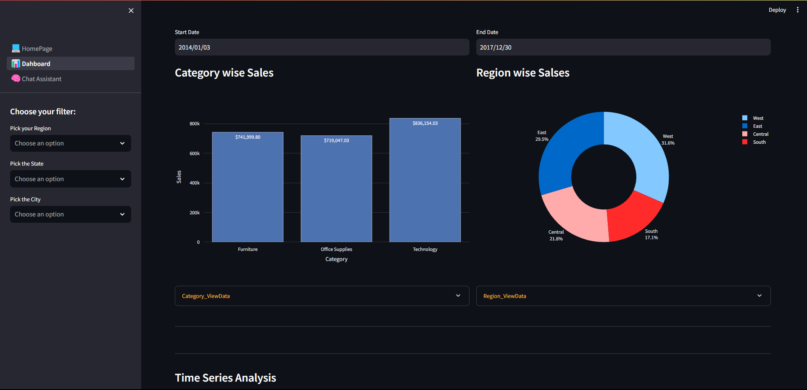
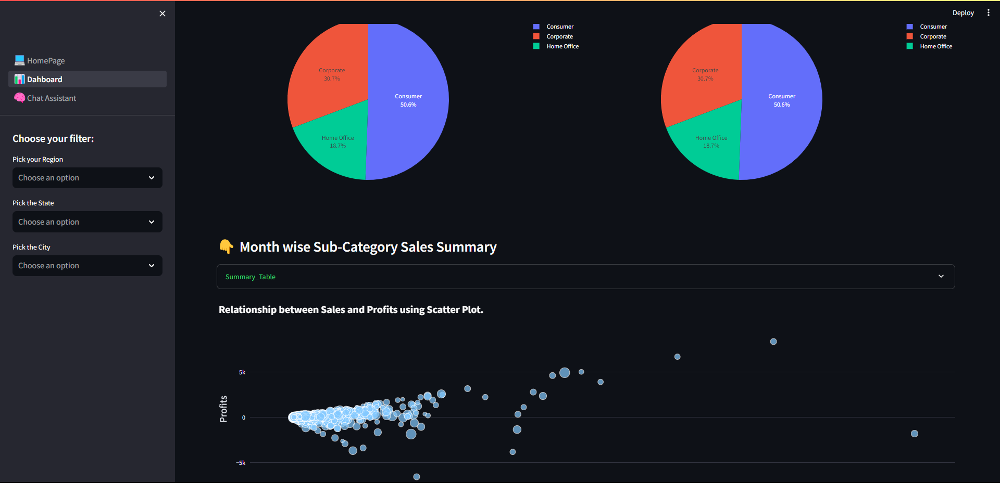
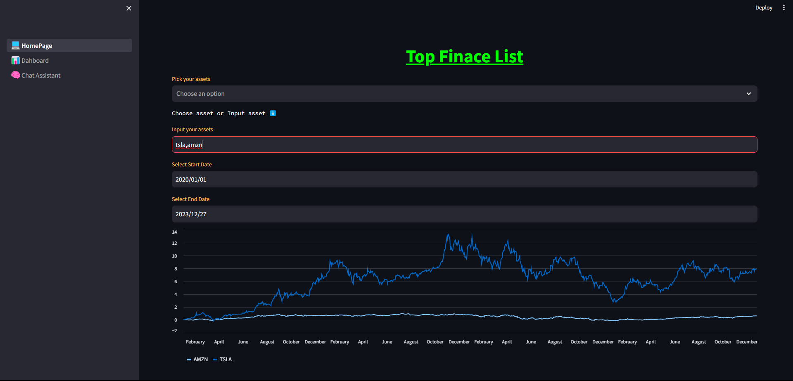

# fin-chat 

# Installition
*In the requirements files*

# .

# Start Project
*In the requirements files*

# .

# Start Project

*write mainfolder/"streamlit run 1._.._Home...py"*

# .

# Project Images
 
*1 page: Homepage is top assets display.*

*2.page: Dashboard is uplad excel files show the grafics*

*2.page: Dashboard is uplad excel files show the grafics*

*Bu dördüncü fotoğrafın başlığıdır.*

*Bu altıncı fotoğrafın başlığıdır.*

