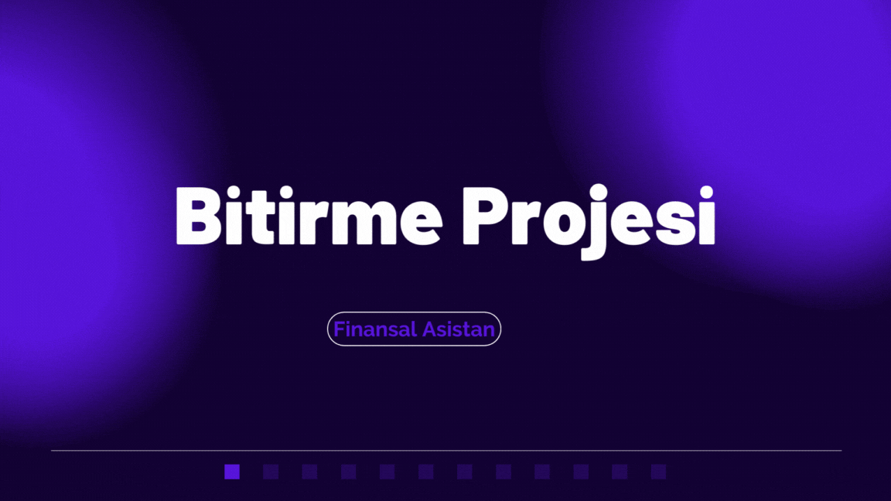
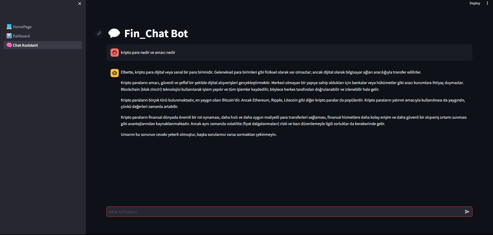

# fin-chat 

# Project Document

### *Document Url:* 

<a  href="https://www.canva.com/design/DAF8evtWEpk2fiKaVZx3-LLAvhRKEZL8Q/view?utm_content=DAF8evtWEpk&utm_campaign=designshare&utm_medium=link&utm_source=editor">
Document</a>

 
 
# Installition
*In the requirements files*

# .

# Start Project

*write mainfolder/"streamlit run 1._.._Home...py"*

# .

 

--- 
# Project Images
 
*1 page: Homepage is top assets display.*

*2.page: Dashboard is uplad excel files show the grafics*

*2.page: Dashboard is uplad excel files show the grafics*

*2.page: Dashboard is show the datas with grafics*

*3.page: Fin-Chat Assistant get information the chat-bot*

